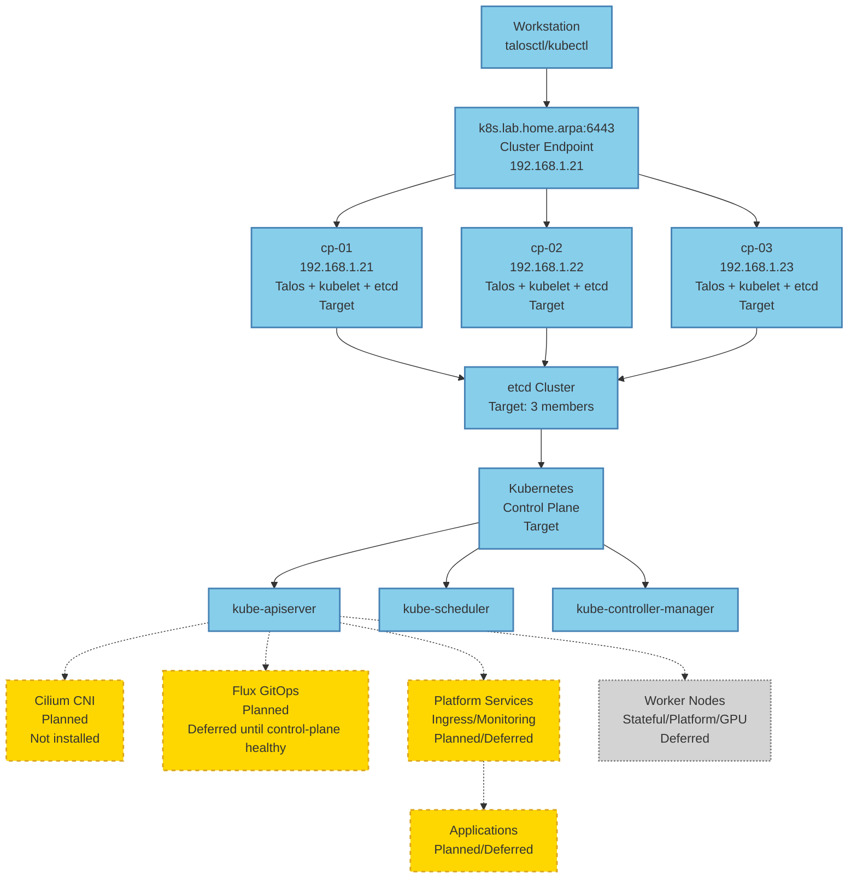

# Logical Cluster Topology

## Legend

- **Solid lines:** Control-plane milestone target
- **Dashed lines:** Planned after control plane is healthy
- **Gray:** Future / deferred

## Control Plane Milestone Target



**Milestone 1 Target:** Three-node Talos control plane with etcd quorum (not yet built)

## Control Plane Components

### Node Components (on each cp-01, cp-02, cp-03)

- **Talos Linux:** Immutable OS
- **kubelet:** Kubernetes node agent
- **kube-proxy:** Network proxy
- **etcd:** Distributed key-value store (clustered across 3 nodes)

### Control Plane Components

- **kube-apiserver:** Kubernetes API server
- **kube-scheduler:** Pod scheduling
- **kube-controller-manager:** Controller loops
- **cloud-controller-manager:** (not used in bare metal)

## Future Components

### CNI (Planned)

```
                +-------+
                | Cilium|
                |  CNI  |
                +-------+
                    |
        +-----------+-----------+
        |           |           |
    +---+---+   +---+---+   +---+---+
    | cp-01 |   | cp-02 |   | cp-03 |
    +---+---+   +---+---+   +---+---+
```

### Platform Services (Planned)

```
                +-------+-------+
                |  Ingress      |
                |  Controller   |
                +-------+-------+
                        |
                +-------+-------+
                |  cert-manager |
                +-------+-------+
                        |
                +-------+-------+
                | external-secrets|
                +-------+-------+
```

### Monitoring (Planned)

```
                +-------+-------+
                | Prometheus    |
                +-------+-------+
                        |
                +-------+-------+
                |   Grafana     |
                +-------+-------+
                        |
                +-------+-------+
                |     Loki      |
                +-------+-------+
```

### Worker Nodes (Deferred)

```
                +-------+-------+
                |  kube-apiserver|
                +-------+-------+
                        |
        +---------------+---------------+
        |               |               |
    +---+---+       +---+---+       +---+---+
    |Worker-1|       |Worker-2|       |Worker-3|
    |Stateful|       |Platform |       |GPU     |
    +---+---+       +---+---+       +---+---+
```

## Data Flow

### Management Flow

1. Workstation → talosctl → Talos API (nodes)
2. Workstation → kubectl → Kubernetes API (cluster endpoint)
3. Kubernetes API → etcd (cluster state)
4. Kubernetes API → kubelet (node scheduling)

### Pod Flow

1. User creates pod via kubectl
2. kube-apiserver validates request
3. kube-scheduler assigns node
4. kubelet on node creates pod
5. Cilium provides networking
6. kube-proxy provides service proxying

## Network Layers

### Layer 1: Physical

- Ethernet connections between devices
- Switch aggregation
- Router gateway

### Layer 2: Logical

- Talos API (port 50000)
- Kubernetes API (port 6443)
- Cilium CNI (VXLAN or Geneve)
- Service networking (ClusterIP, NodePort, LoadBalancer)

### Layer 3: Services

- Ingress controller (HTTP/HTTPS)
- Service discovery (DNS)
- Network policies (Cilium)

## Notes

- Current topology is control plane only
- No worker nodes yet
- Cilium CNI is planned but not installed
- Platform services are planned but not installed
- Monitoring stack is planned but not installed
- Worker nodes are deferred until control plane is stable
