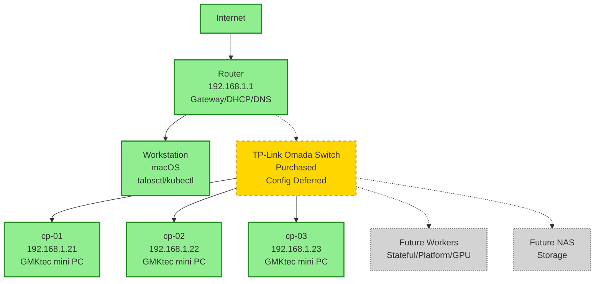

# Physical Topology

## Legend

- **Solid lines:** Current / planned for first control-plane milestone
- **Dashed lines:** Purchased but configuration deferred
- **Dotted lines:** Future / deferred

## Current Physical Layout

**Network:** Flat 192.168.1.0/24 (no VLANs initially)

## Components

### Workstation

- **Role:** Management workstation
- **OS:** macOS
- **Network:** 192.168.1.0/24 (DHCP)
- **Tools:** talosctl, kubectl, git

### Router

- **Role:** Default gateway, DHCP server, DNS forwarder
- **IP:** 192.168.1.1
- **Management:** Web UI or SSH

### Switch (Purchased, Configuration Deferred)

- **Model:** TP-Link Omada 10-port Gigabit Smart PoE+ (exact model TBD until verified)
- **Source:** Micro Center (~$114)
- **Status:** Purchased, configuration deferred
- **Capabilities:** Managed, PoE, VLAN-capable
- **Role:** Network aggregation, future VLAN support
- **Management:** Omada controller (planned)
- **Note:** Not required for initial Talos bootstrap

### Control Plane Nodes

- **cp-01:** GMKtec mini PC, 192.168.1.21
- **cp-02:** GMKtec mini PC, 192.168.1.22
- **cp-03:** GMKtec mini PC, 192.168.1.23

### Future Components

- **Worker Nodes:** Stateful and stateless workers (deferred)
- **NAS:** Network-attached storage (deferred)
- **GPU Worker:** AI/ML workloads (deferred)

## Network Connections

### Current Connections

- Workstation ↔ Router (WiFi or Ethernet)
- Router ↔ Switch (planned)
- Switch ↔ cp-01, cp-02, cp-03 (planned)

### Future Connections

- Switch ↔ Worker nodes
- Switch ↔ NAS
- Switch ↔ GPU worker

## Port Mapping (Future)

When Omada switch is installed, document physical port mapping:

| Port | Device | VLAN | Status |
|------|--------|------|--------|
| 1 | Router Uplink | Trunk | Planned |
| 2 | cp-01 | 10 | Planned |
| 3 | cp-02 | 10 | Planned |
| 4 | cp-03 | 10 | Planned |
| 5 | Workstation | 40 | Planned |
| 6-10 | Future | TBD | Planned |

## Notes

- Switch is purchased but configuration is deferred
- Current topology is flat network (no VLANs)
- VLANs will be implemented after control plane is stable
- Switch configuration is not required for initial Talos bootstrap
- Physical connections should be labeled for clarity
